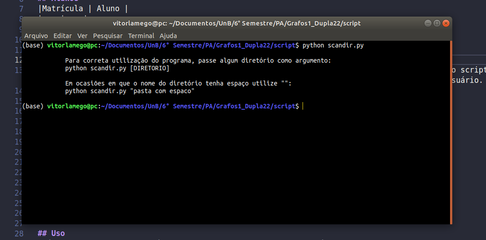
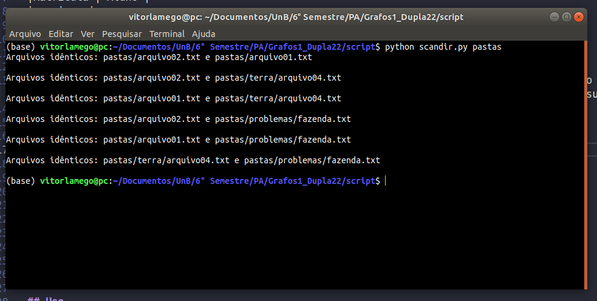
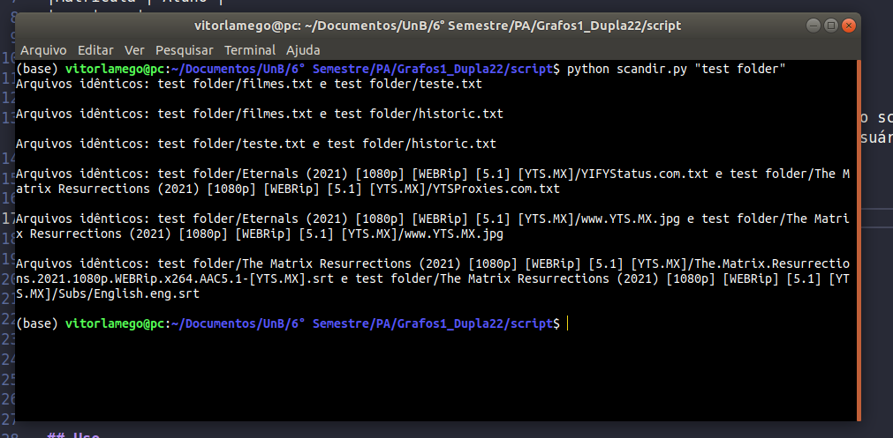

# Buscador de Arquivo Duplicado

**Número da Lista**: 1<br>
**Conteúdo da Disciplina**: Grafos 1<br>

## Alunos
|Matrícula | Aluno |
| -- | -- |
| 19/0020903  |  Vitor Magalhães Lamego |
| 18/0011472  |  Rodolfo Cabral Neves |

## Sobre 
O projeto em questão irá fazer um mapeamento dos diretórios do usuário que estiver rodando o script utilizando grafo direcionado, mapeando todos os arquivos e subdiretórios presentes.

Após o mapeamento do diretório raiz e seus respetivos subdiretórios, se tiver arquivos duplicados em diferentes diretórios o programa **deverá** apresentar os arquivos similares em conteúdo.

## Screenshots




## Instalação 
**Linguagem**: Python<br>

Obs: Para a correta execução do programa pode ser necessário que o usuário possua Python 3 instalado na máquina.

## Uso 
Para utilizar o programa, basta acessar a pasta "script" pelo terminal e digitar:

```
python scandir.py [diretorio]
```

Em caso de dúvidas, utilize as imagens.

## Outros 
[Link para apresentação do projeto](https://unbbr.sharepoint.com/sites/Projeto-ProjetodeAlgoritmos/Documentos%20Compartilhados/General/Recordings/Reuni%C3%A3o%20em%20_General_-20220207_204542-Grava%C3%A7%C3%A3o%20de%20Reuni%C3%A3o.mp4?web=1)


